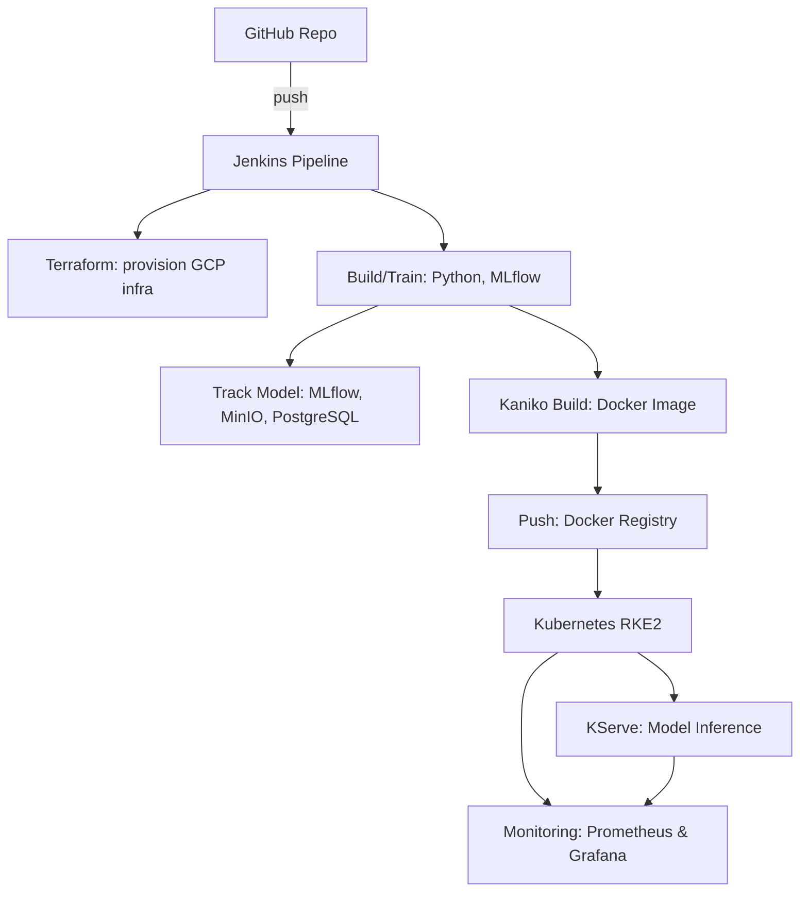

# CI/CD MLOps Pipeline: Automated ML Model Deployment on Kubernetes

> End-to-end pipeline for training, versioning, containerizing, deploying, and monitoring ML models using Terraform, Jenkins, MLflow, Docker, and Kubernetes.

## Overview

This repository implements a production-ready MLOps workflow for automating the lifecycle of ML models, from infrastructure provisioning to deployment and monitoring, using open-source tools.

**Main features:**
- Infrastructure as Code (Terraform) for cloud-agnostic provisioning
- Automated CI/CD (Jenkins Pipelines)
- Experiment and model tracking (MLflow + MinIO)
- Production model serving (Docker, Kubernetes, KServe)
- Monitoring and drift detection (Prometheus, Grafana)

---

## Architecture

<details>
<summary>Click to expand Mermaid diagram (requires GitHub or Markdown rendering that supports Mermaid)</summary>


</details>

---

## Tech Stack

- **CI/CD:** Jenkins, Kaniko
- **IaC:** Terraform (cloud-agnostic; GCP default)
- **Containerization:** Docker
- **Orchestration:** Kubernetes (RKE2)
- **Experiment Tracking:** MLflow
- **Object Storage:** MinIO (S3-compatible)
- **Model Serving:** KServe
- **Monitoring:** Prometheus, Grafana
- **Ingress:** NGINX
- **Database:** PostgreSQL
- **Helm** for Kubernetes package management

---

## Repository Structure

```
.
├── terraform/                # Terraform scripts for infra provisioning (VMs, networking, firewall)
├── jenkins/                  # Jenkinsfile, pipeline scripts
├── kubernetes/               # Helm charts, K8s YAML manifests
├── ml-models/                # ML training scripts, requirements.txt
├── docs/                     # Diagrams, documentation
└── README.md
```

---

## Usage

### 1. Provision Infrastructure

Edit `terraform/variables.tf` for your cloud project and credentials.

```bash
cd terraform
terraform init
terraform apply
```

### 2. Configure Jenkins

- Set up Jenkins on your infra (standalone or Dockerized)
- Store secrets (cloud keys, DockerHub, etc.) in Jenkins Credentials
- Update the `Jenkinsfile` as needed

### 3. Deploy MLOps Stack

- Use provided Helm charts/YAMLs in `kubernetes/` to deploy:
  - MLflow + PostgreSQL
  - MinIO
  - Prometheus + Grafana
  - KServe (+ Istio, Knative, NGINX Ingress)

### 4. Run the CI/CD Pipeline

- Push a commit to GitHub to trigger the Jenkins pipeline
- Pipeline steps:
  - Infra provisioning (can be skipped for dev)
  - Model training (runs as K8s job, logs to MLflow)
  - Model packaging (Kaniko builds Docker image from MLflow artifact)
  - Deployment (image deployed via KServe, exposed via Ingress)
  - Monitoring (Prometheus scrapes metrics, Grafana dashboards)

---

## Endpoints

| Service      | Default Path                        | Notes                   |
|--------------|------------------------------------|-------------------------|
| MLflow UI    | `/mlflow`                          | Experiment tracking     |
| MinIO        | `/minio`                           | Artifact storage        |
| Grafana      | `/grafana`                         | Monitoring dashboards   |
| KServe Model | `/v1/mlflow-model/<name>:predict`         | REST inference endpoint |

All services are routed via NGINX Ingress: `http://<EXTERNAL_IP>:32255/<service>`

---

## Requirements

- Terraform >= 1.5.x
- Docker
- kubectl, helm
- Jenkins (standalone or containerized)
- GCP account (or adapt scripts for AWS/Azure)
- Python 3.10+ for ML training

---

## Customization

- Replace the sample model in `ml-models/` with your own ML code
- Adjust `Jenkinsfile` for different workflows or cloud providers
- Add/modify monitoring & alerting via Grafana

---
